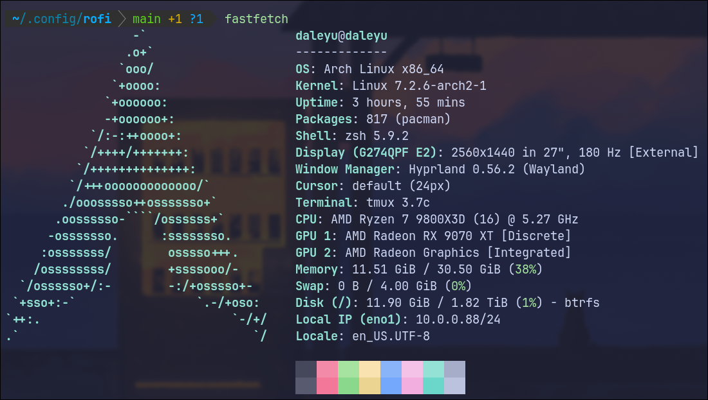

# dotfiles

## Arch Linux
Run `./install_linux.sh`.

Wayland + hyprland
- Look at arch.txt to see arch packages
- Hyprland is in the hyprland folder

Still working on setting up arch 



## MacOS
`/install_mac.sh`


## Custom Keyboard layout

My Keyboard layout. Extension of Dvorak
#### Base Layer
+---+---+---+---+---+---+---+---+---+---+---+---+---+-------+
| ` | ! | [ | ] | { | $ | * | } | = | ( | ) | & | ^ | BKSP  |
+---+-+-+-+-+-+-+-+-+-+-+-+-+-+-+-+-+-+-+-+-+-+-+-+-+-------+
| TAB | ' | , | . | p | y | f | g | c | r | l | / | @ |   \   |
+-----+-+-+-+-+-+-+-+-+-+-+-+-+-+-+-+-+-+-+-+-+-+-+-+-------+
| ESC   | a | o | e | u | i | d | h | t | n | s | - | ENTER |
+-------+-+-+-+-+-+-+-+-+-+-+-+-+-+-+-+-+-+-+-+-+-+-+-------+
| SHIFT   | ; | q | j | k | x | b | m | w | v | z | SHIFT   |
+---------+-+-+-+-+-+-+-+-+-+-+-+-+-+-+-+-+-+-+-+-+---------+

#### Shift Layer
+---+---+---+---+---+---+---+---+---+---+---+---+---+-------+
| ~ | 1 | 2 | 3 | 4 | 5 | 6 | 7 | 8 | 9 | 0 | % | # | BKSP  |
+---+-+-+-+-+-+-+-+-+-+-+-+-+-+-+-+-+-+-+-+-+-+-+-+-+-------+
| TAB | " | < | > | P | Y | F | G | C | R | L | ? | + |   |   |
+-----+-+-+-+-+-+-+-+-+-+-+-+-+-+-+-+-+-+-+-+-+-+-+-+-------+
| ESC   | A | O | E | U | I | D | H | T | N | S | _ | ENTER |
+-------+-+-+-+-+-+-+-+-+-+-+-+-+-+-+-+-+-+-+-+-+-+-+-------+
| SHIFT   | : | Q | J | K | X | B | M | W | V | Z | SHIFT   |
+---------+-+-+-+-+-+-+-+-+-+-+-+-+-+-+-+-+-+-+-+-+---------+


On arch linux sometimes Keyd is a little buggy so, you have to start the daemon
and then reload it to get the most recent changes
```
sudo systemctl enable --now keyd

sudo keyd reload
```

## Using Stow for dotfile locations

```Installation
brew install stow
// or
sudo apt get stow
```

### Usage
Stow will position the dotfile at the $HOME directory if used by default. Stow
by default sets the file at the parent directory, so you have to specify the
target path.
```Adding a Stow
stow --target="/Users/[username]" tmux
```

How to delete a stow not at base path
```
stow -D --target="/Users/[username]" tmux
```

## Brew packages
Download homebrew first
```
/bin/bash -c "$(curl -fsSL https://raw.githubusercontent.com/Homebrew/install/HEAD/install.sh)"
```

BrewFile [Untested]
- I think I can install everything I need through the brewfile but I haven't
tested this. Will test next week
```
brew bundle
```

Run this to install all brew packages
```
brew install fish jesseduffield/lazygit/lazygit tmux clipboard fzf gcc gh glow neovim node powerlevel10k python ripgrep rust stow tree-sitter wget yazi zoxide go cava graphviz eza ast-grep reattach-to-user-namespace luarocks bat
```
Casks
```
brew install --cask font-hack-nerd-font alt-tab discord firefox obsidian topnotch ghostty google-chrome typora nikitabobko/tap/aerospace
```

## Fonts
My font of choice is jetbrains mono nerd font, and I get the ttf files from
here. After I get the ttf files, it only needs to be added to the font book for
MacOS and then it can be loaded in by name through different applications.
- Yes I use ligatures, I just personally like them.

https://www.nerdfonts.com/font-downloads


## Git
See my git.md in docs.
Remember to include my global path here: 
```
[include]
    path = ~/.config/git/config
```

## Fish 
> Note: I use zsh because zsh is everywhere and fish isn't and there is not
> always the best Fish support at large companies. I found it easier to use zsh
> (I have tried bash before and didn't see a difference)
~~My Terminal of choice for personal computer~~ 
- My theme is fish tide [equivalent to powerlevel10k]
 
Check my fish docs in the docs folder for more specific information.

#### Fisher Plugin Manager
I use fisher instead of omf. I found that omf was more than what I needed, and
that fisher is more widely supported and stable. 
- To download a fisher plugin I would use `fisher install <plugin>`

## ZSH
Terminal used for work. I just use ohmyzsh and then a really minimal setup.
I am not bothered to go beyond that. 

## Zoxide
first `brew install zoxide`
import autojump files with `zoxide import --from=autojump "$HOME/Library/autojump/autojump.txt"`
I replace cd with z because it fits and works for all my use cases. Fish also
has a nice command autocompleter which will show the whole command you ran even
if aliased. 

## Setting up Yazi file manager

Install the packages
```Install packages
brew install yazi ffmpeg sevenzip jq poppler fd ripgrep fzf zoxide imagemagick font-symbols-only-nerd-font
```
Download the Catppucin theme
```
ya pack -a yazi-rs/flavors:catppuccin-macchiato
```

## Setting up Spicetify

The `spicetify` Stow package includes the official Catppuccin theme. See
[spicetify/README.md](spicetify/README.md) for the Arch Linux setup commands and
Mocha activation steps.

## Waybar
Waybar was stolen from some theme online and then had stuff added to it.

## SketchyBar

Install SketchyBar
```bash
brew tap FelixKratz/formulae
brew install sketchybar
brew install borders
```
There are a series of fonts and stuff that need to be downloaded
```
brew install --cask font-hack-nerd-font
```
You also need to download the font from apple. It is called SF symbols and it
can be found here: https://developer.apple.com/sf-symbols/
- You also there are other nerd fonts to explore, but I tried this https://www.nerdfonts.com/
    - There are prob other nerd fonts through brew that are good. 

- Remember to stow the SketchyBar Config
```bash
brew services start sketchybar
brew services restart sketchybar
```
- Start Sketchybar as a background process
    - Sometimes this won't work on a company laptop, even with the same config.
      it must be an issue with the extra security or software on it.

## Setting up Node environment
I think this can be replaced by mise
- NVM as node version manager
`https://github.com/nvm-sh/nvm`

- Fish has to use nvm.fsh
`https://github.com/jorgebucaran/nvm.fish`

- Installing Bun
    - install using node and just follow the website. I hate JS though.

## Language Setups
MIGRATED TO DOCS FOLDER. Check specific language doc. 

### Selene and Rust

Setup rust with rustup
```
curl --proto '=https' --tlsv1.2 -sSf https://sh.rustup.rs | sh 
```
Now we need to get selene. 
```
cargo install selene
```
Make sure you `chmod +x ~/.cargo/bin/selene`

### Javascript

##### Working with Prettier
install prettierd with npm

### Zig

##### Installing with a Package Manager
It is possible to install zig using a brew, which is on their official
documentation. It is better to use zvm or mise though. 
- Brew [only stable release]
```
brew install zig
```

##### Installing development build
Zig is not in stable beta, so I've been manually installing from source and
adding to my path
- Navigate to zig website and download for system's architecture. 
- Move the folder to $HOME and the add to path with 
```
export PATH="$HOME/zig-macos-aarch64-[version]:$PATH"
```

*Enabling on MacOS*
- Navigate to privacy and security.
- scroll down and allow anyways for zig.


### Dart and Flutter
TODO

### Java
TODO

### Ruby
TODO

### Python
TODO

### Lua
TODO

### Markdown Preview
- You need to have node.js and yarn installed.
I use nvm to handle all my node stuff so I just curl get nvm from github like
`curl -o- https://raw.githubusercontent.com/nvm-sh/nvm/v0.40.1/install.sh | bash`
and then I install yarn with like `npm install --global yarn`

> Right now Markdown preview has a weird bug where the installation script
> hasn't been working for me without rerunning the install script
This means you should run the command to rerun the install.sh
```
cd /Users/bytedance/.local/share/nvim/lazy/markdown-preview.nvim/app
./install.sh
```

### Setting up VimTex and Zathura
Not gonna bother with this since it isn't needed.

## Disclaimer 
Note to myself from the future, this whole config was at one point entirely not
touched by AI. 
- As of September 28th, the only AI generated portion should be the keyboard
  mapping portion
