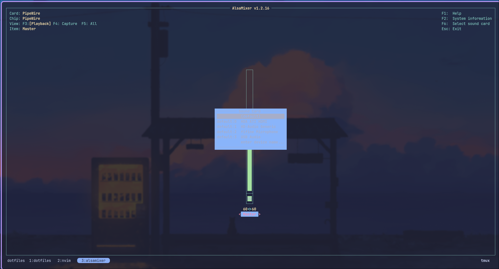
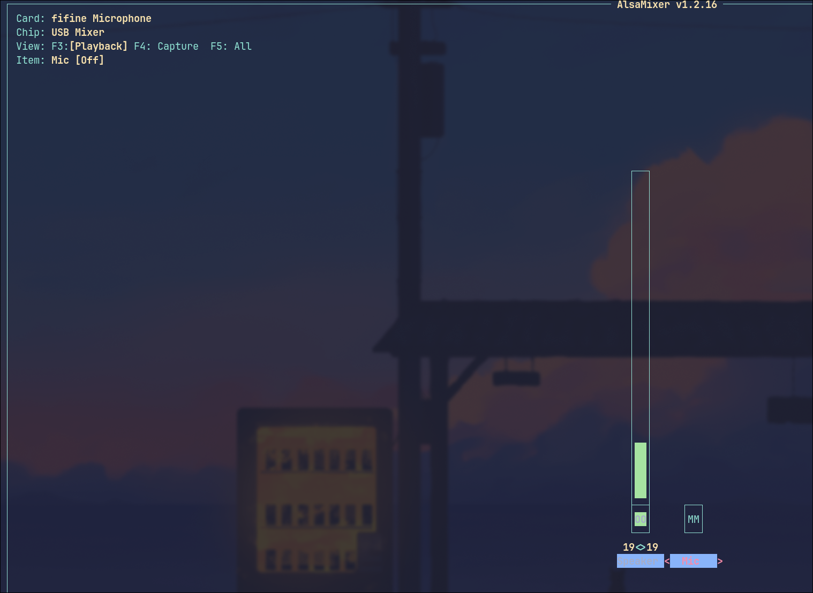

# Arch Configuration

## Syncing up the Linux packages
The list of linux packages can be found in the arch.txt which is found at the
root of the directory
- For resyncing the packages then it is run through this command 
`pacman -Qqe > arch.txt`

## Turning off mic Playback
There is an annoying issue with the cheap Fifine mic, where it will have
autoplayback enabled and keep trying to enable it.
- On linux this is disabled through use of alsamixer.

1. Open up Alsamixer which is downloaded through  and change the input to fifine
   mic
    - `sudo pacman -S alsa-utils`

2. From Fifine mic you want to use the right arrow key to go over to the mic and
   then push M.
   - Make sure that at the top it says that the Card is Fifine Microphone
   - You want the mic to show MM on that column which means it is Mic Muted

3. Turn up the mic and make sure that you don't hear yourself
    

