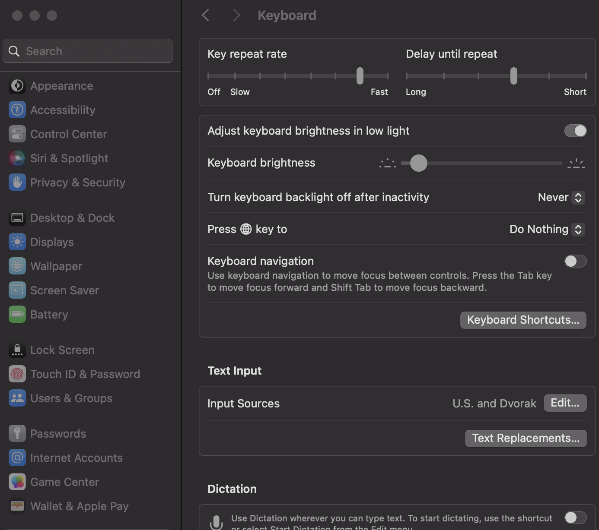
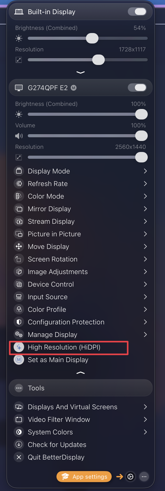

# MacOS Setup

My Development is primarily on MacOS, until I buy my PC and get Linux on there.

## Keyboard specifics

Key repeat rate should be the second fastest.
- Delay until repeat can be in the middle right

Set caps lock to escape and add in the dvorak keyboard layout. 
> capslock can be set to escape by going to keyboard --> keyboard shortcuts ->
> modifier keys -> caps lock key as escape. 

### MacOS specific Configs
`$HOME/Library/Application Support/com.mitchellh.ghostty`

## MacOS Display blurry font

Install BetterDisplay which can be [here](https://github.com/waydabber/BetterDisplay)
- This works better on some monitors compared to the others so it is not exact.

Navigate to the external display and turn on HIDPI

> Note: depending on the display I think that sometimes this makes the font
> still blurry because it adds a black background to it. There is a workaround
> to create a virtual monitor but it adds a little bit of input delay I think.

*Mac setting*
`defaults write -g AppleFontSmoothing -int 0`
- This gets rid of some of the font smoothing but it doesn't fix the scaling issues

