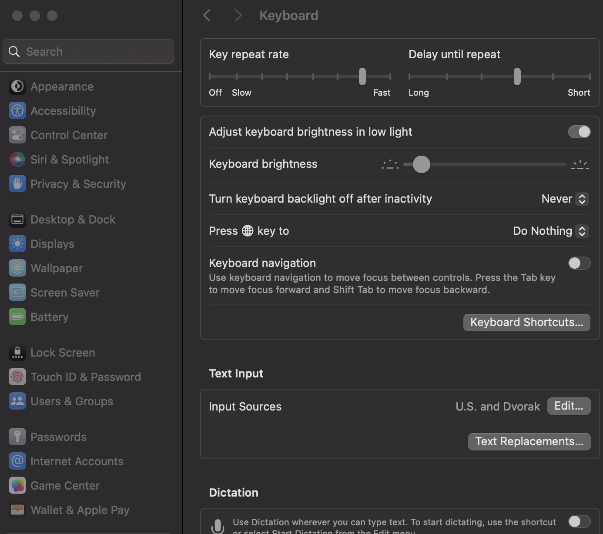

# MacOS Setup

My Development is primarily on MacOS, until I buy my PC and get Linux on there.

## Keyboard specifics

Key repeat rate should be the second fastest.
- Delay until repeat can be in the middle right

Set caps lock to escape and add in the dvorak keyboard layout. 
> capslock can be set to escape by going to keyboard --> keyboard shortcuts ->
> modifier keys -> caps lock key as escape. 
